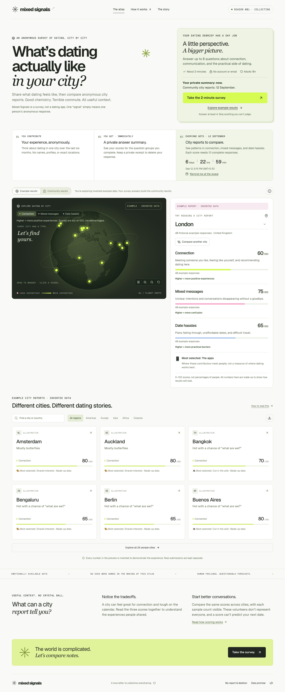
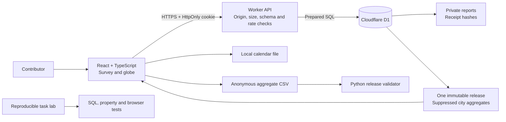

<div align="center">

# ✳ Mixed Signals

### What’s dating actually like in your city?

**An anonymous city dating survey, with useful context and a sense of humor.**

[Explore the live atlas](https://mixed-signals-atlas.sg127977958.chatgpt.site) · [Architecture](docs/ARCHITECTURE.md) · [Run locally](#run-locally) · [Engineering evaluation lab](evals/README.md)

   

</div>



Your group chat has theories about dating in your city. Mixed Signals gives those theories coordinates.

People send a short, anonymous report about dating in one of **101 cities**. A shared seven-day countdown keeps the collective results sealed. At the reveal, an interactive globe shows the contributors' dating weather: chemistry, mixed signals, and the logistics of getting two adults to the same café.

There are no profiles, matches, public individual responses, or city rankings. Just a playful collective experiment with a serious data boundary.

## The experiment

1. **Drop a signal.** Pick a city where you have dated in the last six months. Answer at least four of eight optional questions, then choose a meet-cute habitat. Adults 18+ only.
2. **Get your private summary.** See scores for the question groups you complete, keep a deletion receipt, and download a calendar reminder. No email required.
3. **Let the planet cook.** The collection window is shared by everyone. Refreshing cannot restart it.
4. **Read the atmosphere.** At the deadline, cities with at least ten reports appear. Every individual metric also needs ten complete responses. The release is frozen once.

**Season 001:** 5 September 2026, 13:00 UTC → 12 September 2026, 13:00 UTC. The website shows the reveal in the visitor's local timezone.

The preview uses **24 explicitly fictional city fixtures**. These never enter the production database. After the collection window closes, a quiet season is shown honestly if no city clears the threshold.

## What actually works

- A draggable, rotating, zoomable point-cloud globe with real geographic coordinates and a local Natural Earth dataset. No map API key, remote tiles, or paid geocoding.
- Readable city reports with all three scores, their definitions, directions and sample counts; two-city comparisons, region filters, shareable views and clearly labeled CSV exports.
- A six-step survey with literal questions, actual answer progress, a Local correspondent completion badge, keyboard controls, consent, draft preservation, validation, and retry-safe submissions.
- Real Cloudflare D1 persistence, database-enforced uniqueness, server and SQL deadline checks, and transactional reveal creation.
- Recovery after a response is lost, private receipt download/restore, and withdrawal from another browser using the receipt.
- Partial personal summaries remain useful when questions are skipped, and older deletion receipts remain compatible.
- A real `.ics` reminder. No pretend email integration or unconfigured email promise.
- Complete-case scoring, per-metric suppression, one-time snapshots, and traffic-driven raw-data retention.
- Mobile layouts, reduced motion, a keyboard-accessible city list, error/empty states, and structured browser agent tools.
- A Python release validator and three reproducible engineering tasks with golden patches and fail-before/pass-after grading.

## Run locally

Prerequisites: **Node.js 22.13+**, npm, and **Python 3.10+** for the evaluation lab and release validator. The lockfile is committed. No cloud account or secrets are needed for local development.

```bash
git clone https://github.com/shi1720/mixed-signals.git
cd mixed-signals
npm ci
npm run db:migrate
npm run dev
```

Open the URL printed by the dev server. Local D1 state lives under `.wrangler/state/` and survives restarts. It is ignored by Git and is never uploaded with deployment artifacts.

The default campaign intentionally has a fixed historical window. If you are trying the project after its reveal, the real survey will be closed. The illustrative preview still works. To run your own experiment, follow [starting a new season](docs/DEPLOYMENT.md#starting-a-new-season).

## Verify it

```bash
npm run check                 # Strict types, lint, real-SQL tests and property checks
npm run test:python           # Streaming release validator tests
npm run eval:verify           # All 3 broken baselines fail, all 3 golden solutions pass
npx playwright install chromium
npm run test:e2e              # Desktop + mobile against a local Worker/D1 runtime
npm run build                # Production Worker and browser assets
npm audit                    # Dependency advisories
```

Tests deliberately cover deadline races, concurrent duplicate requests, null semantics, per-axis privacy thresholds, immutable releases, withdrawal ordering, retention, hostile requests, receipt recovery, offline retries, and keyboard/accessibility behavior. The SQLite unit adapter is explicitly distinguished from the real local D1 runtime tested through the browser.

Browser tests refuse non-local URLs, so synthetic reports cannot accidentally pollute the public experiment. See [verification and limitations](docs/TESTING.md).

## Architecture at a glance



The database controls the final acceptance gate. A request that passed JavaScript validation but reaches SQLite after the deadline is rejected. Snapshot creation is a single guarded `INSERT … SELECT`, so it is atomic and does not rescan survey rows once the release exists. Deleting a report after the deadline freezes the release first in the same transaction.

The interface uses plain names: **Connection**, **Mixed messages**, and **Date hassles**. Higher Connection means more positive experiences; higher Mixed messages or Date hassles means more difficulty. Scores are not percentages of people. API/CSV field names stay stable.

Read [the architecture](docs/ARCHITECTURE.md), [API contract](docs/API.md), [data methodology](docs/METHODOLOGY.md), and [design decisions](docs/DECISIONS.md).

## Why this is an engineering project

The playful surface creates real systems problems: retries cannot double-count people, skipped answers cannot become invented sentiments, a reveal cannot leak early, and watching scores must not reveal someone's new response. The implementation makes those contracts explicit and tests them.

The [evaluation lab](evals/README.md) turns three actual application modules into independently reproducible coding tasks. Each task includes a problem statement, a controlled defective baseline, a reference patch, a bounded test command, and machine-readable grading. These are public calibration exercises, not claims of a secret or comprehensive benchmark.

For a concise portfolio explanation, see [the project pitch](docs/PITCH.md).

## Data and limitations

This is a self-selected, unrepresentative survey, not a scientific census, dating advice, or proof that a city is good or bad. Cookie uniqueness reduces accidental duplicates but does not prove unique humans. Ten-person suppression reduces disclosure risk; it is not formal differential privacy.

The app does not collect identity, email, gender, orientation, exact location, photos, or free-text accusations. Infrastructure providers still process connection metadata. Abuse controls use a daily keyed network hash when the platform supplies an IP, and an anonymous browser token. Read [SECURITY.md](SECURITY.md).

Raw reports are deleted on the **first site visit at least 30 days after the reveal**, after freezing the aggregate. With no traffic, cleanup waits for the next visit. The architecture supports adding a scheduled job if strict wall-clock retention is required. It does not promise email delivery, independent audits, high-volume capacity, or formal anonymity.

## Deploy and operate

The reference deployment uses **Cloudflare Workers + D1 through Sites**, allowing the complete project to run without billing credentials or a paid map service. [Deployment instructions](docs/DEPLOYMENT.md) cover local operation, an independent Cloudflare deployment, release checks, retention, and a future GCP migration boundary. A Firestore adapter is not claimed or included.

## Credits

Inspired by [Cami M.'s MIT student restroom map](https://mitadmissions.org/blogs/entry/the-best-and-worst-places-to-%F0%9F%92%A9-on-campus/) and its [original source](https://github.com/camimgh/PoopMap): a reminder that a wonderfully specific question can make collective experience visible. Mixed Signals is independent and not affiliated with MIT.

Geography: [Natural Earth](https://www.naturalearthdata.com/about/terms-of-use/) public-domain data, distributed through [world-atlas](https://github.com/topojson/world-atlas). UI primitives: Base UI and shadcn. Icons: Lucide. Fonts: Geist.

Created by [Shivam Gupta](https://github.com/shi1720), with AI-assisted implementation and independent agent reviews. No fabricated users, traffic, employment history, or performance claims.

[MIT licensed](LICENSE). Contributions welcome. Please do not submit fabricated survey responses to the public site.
