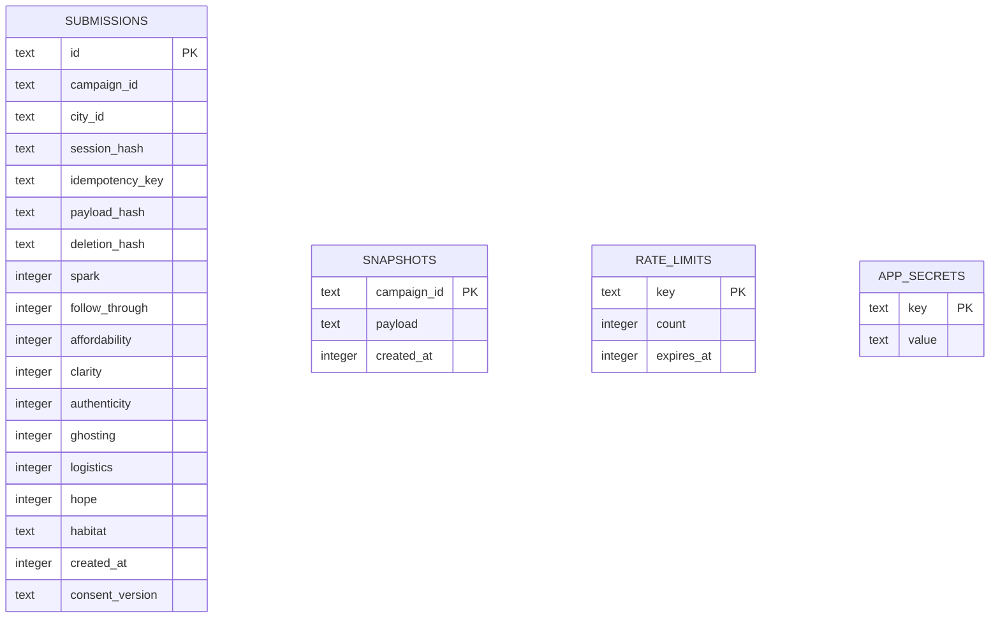

# System architecture

Mixed Signals separates a deliberately playful client from a small, strict publication service. TypeScript owns the web application and API. SQLite owns acceptance, uniqueness, and release atomicity. Python validates exported release artifacts and runs the calibration tasks.

## Components

| Surface | Responsibility | Main files |
|---|---|---|
| Browser | Survey, drafts, receipt, interactive globe, city list | `app/page.tsx`, `components/atlas/` |
| Domain | Campaign clock, known cities, validation, scoring | `lib/campaign.ts`, `lib/cities.ts`, `lib/survey.ts`, `lib/forecast.ts` |
| API | Exact origins, bounded JSON, sessions, validation, retries | `lib/server/http.ts`, `lib/server/service.ts` |
| Persistence | Prepared SQL, constraints and indexes | `db/schema.ts`, `drizzle/` |
| Publication | Suppression before serialization, atomic immutable snapshot | `lib/server/aggregation.ts` |
| Retention | Freeze then purge after the disclosed retention deadline | `lib/server/maintenance.ts` |
| Artifacts | Calendar generation and streaming release validation | `lib/calendar.ts`, `tools/verify_release.py` |
| Evaluation | Isolated defective baselines and reference patches | `evals/` |

## Submission sequence

```mermaid
sequenceDiagram
    participant B as Browser
    participant W as Worker
    participant D as D1
    B->>W: GET /api/session
    W-->>B: Secure HttpOnly browser cookie
    B->>B: Save pending payload + random receipt secret
    B->>W: POST /api/signals (idempotency key)
    W->>W: Exact origin, 4 KiB limit, schema, eligibility
    W->>D: Look up same-session prior submission
    alt Identical successful retry
        D-->>W: Existing submission ID
        W-->>B: Same ID and personal forecast
    else First submission
        W->>D: Atomic rate counters
        W->>D: INSERT SELECT with SQL time gate and unique keys
        D-->>W: Accepted ID or conflict
        W-->>B: Receipt ID and personal forecast
    end
    B->>B: Save private receipt; clear draft and pending request
```

The receipt secret is generated before the request. Only its SHA-256 hash is stored in D1. If the response is lost, the same browser replays its saved request to recover the original receipt. Idempotency compares the session, request key, payload hash, and deletion hash. A key cannot retrieve another browser's report or mutate prior answers.

## Storage model



Two unique indexes enforce `(campaign_id, session_hash)` and `(campaign_id, idempotency_key)`. The `(campaign_id, city_id)` index supports grouping and categorical aggregation. Integer check constraints backstop API validation. Production queries use a single statement per `prepare`, with transactional `batch` when an operation needs multiple statements.

## Reveal and withdrawal invariants

1. The collection window is configured in source and evaluated on the server.
2. The final insert separately checks SQLite's clock and the absence of a snapshot. A delayed Worker cannot insert after closing.
3. Before the deadline, `/api/results` returns an empty city list, never provisional aggregates.
4. At the deadline, one `INSERT … SELECT` creates the full release. The primary key makes concurrent creation idempotent.
5. Both city count and each metric's complete-case count must meet ten. Suppression occurs inside SQL before serializing JSON. Below-threshold metric denominators are returned as zero rather than precise small counts.
6. Scores are rounded to multiples of five. No gender, age, identity, district, or narrow subgroup filters exist.
7. Once a release exists, a guard prevents repeated aggregate scans. A normal read fetches the persisted payload directly.
8. Post-deadline deletion and retention first establish the snapshot, then delete raw records in the same transaction. Public results remain unchanged.

The snapshot is frozen at first access after closing, not by a background timer. The SQL acceptance gate means this produces the same closed-window dataset. Post-close deletion respects the same ordering even if it is the first operation after the deadline.

## Rendering and performance

The globe renders approximately 4,500 precomputed land points. Latitude spacing is adjusted by `cos(latitude)` to avoid dense poles. Cities use the same orthographic projection as the land and graticule. Back-facing points are culled, pixel ratio is capped at two, animation is throttled to roughly 30 fps, and offscreen/hidden tabs skip rendering. Reduced motion starts with rotation paused.

The geography asset is bundled locally. There are no runtime geocoding calls, map tiles, access tokens, or external font fetches required by the deployed globe. A semantic city list provides the same forecasts without canvas interaction. Read-only public exports contain aggregate fields only.

First reveal is O(N + C) over reports and cities, with categorical grouping using the campaign/city index. Subsequent releases read the stored O(C) payload. This is not a benchmark claim; the tests instrument aggregate evaluation to catch rescans without flaky timing thresholds. The design targets a small public experiment. A production load test and platform quota review are necessary before a large campaign.

## Availability and failure behavior

- Database errors return a generic 503. No SQL, request body, or receipt material is returned or logged by application error handling.
- A 15-second client timeout keeps answers intact and permits an identical retry.
- Anonymous browsing of illustrative data continues during a database outage.
- The health endpoint verifies the expected schema, not merely a TCP connection.
- No email service is required. Calendar reminders are ordinary downloadable files.
- Raw retention is traffic-driven, precisely disclosed in the interface. A stricter retention SLA needs a scheduled caller of the same maintenance operation.

## Trust boundary

The Worker is the only database reader. The client never receives credentials or raw dataset rows. Cookie and network-rate controls deter casual abuse but do not verify human identity. The database salt and hashes are pseudonymous metadata, not a claim of irreversible anonymity. The platform owner can access their database through infrastructure administration, as with any server-hosted survey.
